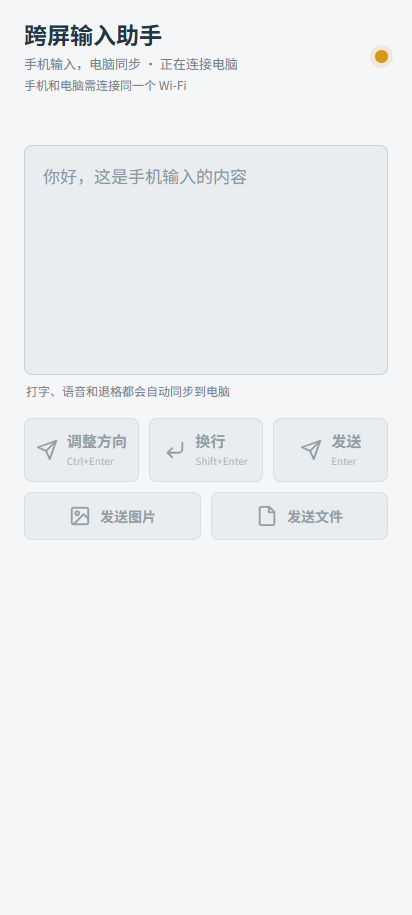

# 跨屏输入

把 Android 手机输入法产生的文字，通过局域网发送到 Windows 当前光标位置。

## 运行

1. 确保手机和电脑连接同一个 Wi-Fi。
2. 双击 `启动语音输入.bat`。
3. Windows 防火墙首次询问时允许“专用网络”。
4. 手机扫描窗口中的二维码。
5. 在电脑上点回需要输入文字的位置。
6. 手机点输入框，使用手机键盘或输入法里的麦克风。

普通输入短暂停顿后会自动发送，输入法完成组词或语音识别后会立即发送。

## 功能

- 手机键盘、输入法语音输入和退格同步
- 清空按钮同步删除电脑端文字
- 换行：`Shift+Enter`
- 发送：`Enter`
- 调整方向：`Ctrl+Enter`
- 发送图片和文件

## 使用截图




## 注意事项

- 手机和电脑需连接同一个 Wi-Fi。
- 图片和文件粘贴是否生效，取决于目标软件是否支持剪贴板附件。
- Windows 防火墙首次提示时，请允许专用网络访问。

## 开发运行

```powershell
py -m pip install -r requirements.txt
py desktop_app.py
```
